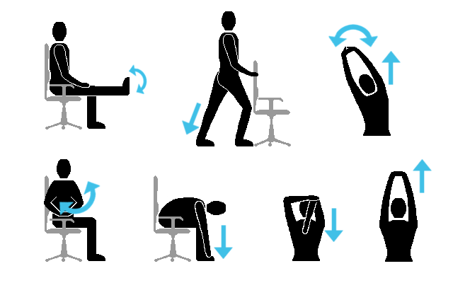

## Questions?


## Recurrent events

Nothing in the formulas requires people to go away after they have an event. We don't even need to rewrite the partial likelihood

$$p(\beta)= \frac{\lambda_0(t)e^{z_i(t)\beta}}{\sum_{j\textrm{ observed at } t} \lambda_0(t)e^{z_j(t)\beta}}=\frac{e^{z_i(t)\beta}}{\sum_{j\textrm{ observed at } t} e^{z_j(t)\beta}}$$

Now we are asking about how the **current** value of $z$ affects the rate of events.

Define $Y_i(s)=1$ between the starting time and ending time, $Y_i(s)=0$ otherwise. All the same formulas work. 


We also get recurrent events for free<sup>*</sup>!

<sup>*</sup> <sup>terms and conditions apply</sup>

## Computation

Multiple records, just as for time-varying predictors

More than one record for a given person can end with an event

We need an `id` variable to track which records are the same person

## Issues

**Correlation**: people who have had an event may be at higher risk of a second

- because the first event really increased their risk (eg sprain)
- because the first event revealed they were at high risk (eg asthma)

Easy to handle: variance estimator using `id` variable, similar to GEE for longitudinal data

- `+cluster(id)` in model formula for R
- `, cluster(id)` option for Stata
- `ID` statement and `COVS(AGGREGATE)` option in SAS

---

**Time scale**: should we be comparing

- people at the same time after a fixed time zero? (eg, same age). 
- people at the same time after their previous event? (eg, same recovery time). 

Either can make sense: need to think about which time variable it's most important to adjust for. 

---

**Do we even want it**?

- Time to first event might be more interesting than rate of events
- Factors associated with later events might be different from earlier events (could do interactions with event history)

eg: Factor V Leiden genetic variant is a strong predictor of deep vein thrombosis, but does not predict recurrent DVT in people who have had one. 


## Data setup

Someone has events at times 5, 7, 12, and is censored at time 15

- start 0, stop 5, event=1
- start 5, stop 7, event=1
- start 7, stop 12, event=1
- start 12, stop 15, event=0

or 

- start 0, stop 5, event=1
- start 0, stop 2, event=1
- start 0, stop 5, event=1
- start 0, stop 3, event=0


## Clustered data

- two eyes of same person
- ipsilateral vs contralateral recurrence of deep vein thrombosis
- twins/triplets/etc
- household members

## Issues

Do you want **matched** comparisons only within groups, or is clustering just a nuisance?

- we care about the difference between same-leg and opposite-leg recurrence of deep vein thrombosis
- we're studying babies, and a few percent of them happen to be multiples. 


## Matched (stratified) Cox model

If we care about comparisons only within a pair, we should use only data from within a pair in the partial likelihood

Label the people in the $i$th pair as $i0$ and $i1$. If $i0$ has an event before $i1$
$$p(\beta)= \frac{\lambda_0(t)e^{z_{i0}(t)\beta}}{ \lambda_0(t)e^{z_{i0}(t)\beta}+ \lambda_0(t)e^{z_{i1}(t)\beta}}=\frac{e^{z_{i0}(t)\beta}}{e^{z_{i0}(t)\beta}+e^{z_{i1}(t)\beta}}$$

More generally, to do comparisons within a **stratum**, the denominator is only a sum over people in that stratum under observation at the same time.

Implies a separate (not estimated) baseline $\lambda_0(t)$ for each stratum


---

Computation:

- `+strata(id)` in R
- `, strata(id)` in Stata
- `STRATA id;` statement in SAS PHREG

Can also be used to handle non-proportional hazards for a discrete variable: comparisons only within the same level of that variable.

## Clustered Cox model

If the clustering is a nuisance, not the primary question, we just want a Cox model for individual observations as usual

Use

- `+cluster(id)` in model formula for R
- `, cluster(id)` option for Stata
- `ID` statement and `COVS(AGGREGATE)` option in SAS

to get correct standard errors.

## Comparing event types

Does antihypertensive treatment reduce stroke risk more than heart attack risk?

Two records per person

- time to stroke
- time to heart attack

Not just using within-person comparison: too little data

Treat as clusters. 

## More complicated

We might care about estimating the **correlation** within a cluster

- are monozygotic (identical) twins more similar than dizygotic (fraternal) twins?
- are you more likely to graduate late if your flatmates do?

This is harder, and the models depend on context.  The R `coxme` package handles heritability estimation for family-based genetics. 

## Exercise




## Questions?


## Competing risks

Example: tumours are removed surgically, and the surgeon is interested whether the removal is complete enough

- surgery couldn't do anything about metastases
- surgeon wants the time to *local* recurrence, censored at death or distant recurrence

Example: blood pressure treatment reduces risk of stroke and heart disease

- researchers want time to stroke or heart attack
- deaths from other causes shouldn't be affected by treatment, use as censoring time

## Problem

Ignorable censoring assumption would say that someone who died of another cause was still at the same risk of stroke or heart attack or local recurrence as someone still alive

They aren't. They're dead. 

Ignorable censoring **can't be** true in the usual sense: competing risks aren't really censoring.

**Conceivable** that someone who died of another cause would still be at the same risk of stroke or heart attack or local recurrence as someone still alive, if they hadn't died.  Unlikely.

## Ignorable?

Why might...

- someone who had a distance cancer recurrence have been at a higher or lower risk for local recurrence?
- someone who had a heart attack have been at a higher or lower risk for cancer?

...talk to the person next to you for a couple of minutes.

## What can we estimate?

**Crude incidence**: what proportion of people get/don't get local recurrence or stroke by time $t$? Crude incidences add up to total incidence: $1-\hat{S}(t)$

**Cause-specific hazard**: rate of events from a specific cause. Cause-specific hazards add up to total hazard : $\hat{\Lambda}(t)$

Both involve removing the effect of actual censoring, but not of competing risks. 

## Not the same

Example: 

- group 1: rates of  30%/year for cancer and non-cancer deaths
- group 2: cancer rate of 20%/year, non-cancer rate of 10%/year


Cause-specific hazard of cancer is higher in group 1, but more people eventually die of cancer in group 2 because they don't die of other things first. 

Crude incidence and cause-specific hazard need not agree unless all event probabilities are low.

---

```{r echo=FALSE}
par(mfrow=c(2,1),mar=c(4,4,.1,1))
curve(3+0*x,from=0,to=3,ylim=c(0,4),xlab="Decades",ylab="Rate")
curve(1+0*x,col="red",add=TRUE)
curve((1-exp(-6*x))/2,from=0,to=3,xlab="Decades",ylab="Cumulative Incidence",ylim=c(0,1))
curve((1-exp(-3*x))*2/3,col="red",add=TRUE)

```

## Computation

- Cause-specific hazards are what you estimate if you do a Cox model 'censoring' at deaths from other causes
- Crude incidence is what you estimate if you say someone dying of one cause never dies of other causes and is censored at the end of the study -- but that gets the standard errors wrong.

R package `cmprsk` does crude-incidence comparisons and regression models

`-stcrreg-` and `-stcurve-` in Stata'

`eventcode` option to `PHREG` in SAS

## Questions?


## Ties,  intervals, error

We've assumed that

- we know the start time for each person
- we know the censoring time for each person (if they don't die)
- we know the event time for each person (if they are under observation)

These aren't always true.  

We've also *implicitly* assumed all the event times (in a stratum) are different when writing down the partial likelihood.

## Ties from rounding

Times may get rounded off to the nearest day, week, month.

Software uses various approximations to the partial likelihood. They are all Good Enough except in extreme cases.

R and Stata default to the same approximation; SAS defaults to a cruder one. 

Worth knowing about as a potential explanation if you get slightly different results from the same data with different programs.

## Events only at visit

Some events can only be measured retrospectively by a diagnostic test

- incident diabetes
- HIV infection

We don't know the time ordering of the real events between diagnostic tests, so we don't know who goes in the denominator for the partial likelihood at each event.

If everyone has similar test schedule or test schedule is frequent enough, just pretend the events happen at the test times. 

Otherwise: interval censoring for the Cox model is hard, especially if the covariate of interest is related to test schedule.

## Retrospective assessment

Example: heart attack adjudicated by expert examination of medical records

- date and time is known immediately
- whether it is an event isn't known until later.

Example: vital status from  death certificate records

- nothing known immediately
- date and time will be known, but not for a while

The censoring time should be the last time you **know** the event hadn't happened

## Measurement error

- event may be false positive
- event may be missed
- start time may be wrong (recall error, eg start time for antiretroviral treatment in HIV)

These are hard if the errors are large/frequent.  Ask an expert. 


## Exercise


## Questions?


## Beyond proportional hazards

Why is the Cox model so popular?

- Computationally well-behaved (important in 1980s)
- Close relationship to logistic regression in case-control studies
- Lots of easy extensions
- Mathematically interesting
- Any model is ok when effects are weak

Not because it necessarily fits well. 

## Diagnostics

Useful

- compare predicted survival from the model to the Kaplan-Meier estimator
- smoothed Schoenfeld residual plots

Useful but computationally annoying

- explicit interactions with time

Useless but widely available

- loglog plots (plots of $-\log\Lambda(t)$ by discrete variables)


## Schoenfeld residuals

Given $z_j$ for people at risk at time $t$, we can compute an *average* expected $z_i$ for the person who has an event
$$e(t) = \frac{\sum_{i\textrm{ at risk}}z_j(t)e^{z_j(t)\beta}}{\sum_{j\textrm{ at risk}} e^{z_j(t)\beta}}$$
On average, the person with event will have 'worse' covariates than the whole cohort

We can compare $e(t)$ to the covariates for the person who actually had an event, say, $z_i(t)$.

The *Schoenfeld residuals* are $r(t)=z_i(t)-e(t)$. They have zero mean if the model is correct, and tend to have time trends if proportional hazards is not true.

## Using them

Formal test for correlation between $r(t)$ and some function of $t$.

- R: `cox.zph()`
- Stata: `estat phtest` after fitting a Cox model
- SAS: need to do some work.

Plot a scaled version of the residuals against time, use a smoother to estimate $\beta(t)$

## Example

```{r}
library(survival)
data(pbc)

model<-coxph(Surv(time,status==2)~log(bili)+protime+albumin, data=pbc)
test<-cox.zph(model)
test
```

---


```{r}
par(mfrow=c(1,2),mar=c(4,4,.1,1))
plot(test[1])
plot(test[2])
```

## Useless approach

- Divide `protime` into categories
- Fit a stratified Cox model
- Estimate the baseline cumulative hazard $\Lambda_0(t)$ for each stratum
- Plot the estimates $-\log\Lambda(t)$
- If proportional hazards is true, the curves should be parallel. 

Useless because you can't judge parallelness of curves (even without sampling noise)

## Example

```
m2<-coxph(Surv(time,status==2)~log(bili)+albumin+strata(protime>10),
          data=pbc)
plot(survfit(m2,
      newdata=data.frame(bili=c(3,3),protime=c(9,12),albumin=c(3.5,3.5))),
     fun="cloglog")
plot(survfit(m2,
      newdata=data.frame(bili=c(3,3),protime=c(9,12),albumin=c(3.5,3.5))),
     fun="cloglog", conf.int=TRUE,col=c("blue","goldenrod"))
```

---

```{r echo=FALSE}
m2<-coxph(Surv(time,status==2)~log(bili)+albumin+strata(protime>10),data=pbc)
plot(survfit(m2, newdata=data.frame(bili=c(3,3),protime=c(9,12),albumin=c(3.5,3.5))),
     fun="cloglog")
```

---

```{r echo=FALSE}
plot(survfit(m2,newdata=data.frame(bili=c(3,3),protime=c(9,12),albumin=c(3.5,3.5))),
     fun="cloglog", conf.int=TRUE,col=c("blue","goldenrod"))
```

## Accelerated-failure models.

Instead of modelling risk, model time: some people 'age faster' than others

$$\log T = \log T_0+z\beta$$
$e^\beta$ is the proportional difference in survival time for a one-unit difference in $z$.

We can't (easily) avoid modelling $T_0$: we need to chose a parametric distribution. 

## Simple cases

If the rate is constant over time then both proportional haazards and accelerated failure are true

- $\lambda_0(t)=\lambda$
- $P(T_0>t)=e^{-\lambda t}$

If the rate has a step increase

- under proportional hazards, different $z$ give different step increases at the same time
- under accelerated failure, different $z$ give step increases at different times. 

## Why?

- want to extrapolate to where there isn't much data (ok with a good model)
- tradition: eg in engineering reliability analysis
- want to get some Normal distributions in there for more complicated modelling ($\log T_0\sim N(\mu,\sigma^2)$)
- left censoring or interval censoring are easier with parametric models

(Note: left **censoring** means a person is in the data set but had the event before they entered)

## Example

For right-censored data, not very different from Cox model

```{r}
coxph(Surv(time,status==2)~log(bili)+protime+albumin, data=pbc)
```

---

```{r}
summary(survreg(Surv(time,status==2)~log(bili)+protime+albumin,
                data=pbc,dist="weibull"))
```

---


```{r}
summary(survreg(Surv(time,status==2)~log(bili)+protime+albumin,
                data=pbc,dist="lognormal"))
```

## Interval censoring

Data on 144 mice raised in a germ-free environment (48 mice) or a conventional environment (96 mice)

At death, they were examined to see if they had lung tumours.  

If a tumor was present, we know it developed before that time If not, the time until it would have developed is after that time (assumptions)

Define a starting time of `NA` (if present) or the death time (if absent) and an ending time of the death time (if present) or `NA` if absent

---

```{r}
load("lungtumor.rda")
summary(survreg(Surv(ltime,rtime,type="interval2")~group,data=lungtumor,
                dist="exponential"))
```

---

```{r}
exp(-1.07)
```

Mice in the germ-free environment developed cancer about three times as fast (or at 1/3rd the age) of those in the conventional environment.

---

Computation

- Stata `-intreg-` fits this model with a Normal distribution. The add-on module `-intcens-` adds other distributions: `ssc install intcens` to download it.
- SAS `PROC LIFEREG` fits this model

## Exercise


## Questions?


## Subsampling

Suppose we have a large cohort (DHB records, clinical trial, etc) and want to measure some new variables on a subset, as efficiently as possible

- classical case-control sampling
- case-only sampling for interactions
- case-cohort sampling
- calibration 
- countermatching

## Case-control

**Incidence density sampling**: sample controls from those who haven't had an event (yet) at the time the case has an event

Under incidence density sampling, the odds ratio in a logistic regression model estimates the same thing as the hazard ratio in a Cox model

If you sample controls based on their status at the end of time, the odds ratio is more extreme (further from 1) than the hazard ratio.

Sampling $k$ controls per case gets you about $k/(k+1)$ fraction of the information in the cohort (so 80% for $k=4$)

As you know, case-control sampling is good for effects of common exposures on rare events 


## Case-only for interactions

Suppose you have a randomised trial with treatment $Z$ and you want to look for interactions with a covariate $G$

- genetic variants
- baseline disease level
- baseline vitamin level in a vitamin trial

By randomisation, $G$ is independent of $Z$ overall.

If there's no interaction, $G$ is also independent of $Z$ in cases

---

For rare events,the odds ratio between $G$ and $Z$ in cases estimates the interaction hazard ratio in the whole trial cohort

For non-rare events, the odds ratio estimates the interaction odds ratio in the whole trial cohort.

There is no loss of efficiency by looking only at the cases (but you can't estimate absolute risk)

The randomisation assumption is **important**, it's where the extra efficiency comes from.

---

```{r}
data(colon)
deaths<-subset(colon, etype==2)
coxph(Surv(time,status)~rx*sex,data=deaths)
```

---

```{r}
summary(glm(status~rx*sex, data=deaths, family=binomial))
```

---

```{r}
summary(glm(sex~rx, data=deaths, subset=status==1, family=binomial))
```


## Case-cohort sampling

Sample all your cases, plus some random subcohort of the cohort

- biased sample
- correct the bias by using weights = 1 for cases, $1/\textrm{sampling probability}$ for others ('extra votes')

Slightly less efficient than case-control sampling for a single question, but

- can later collect additional cases for same controls
- can use multiple case sets with the same controls
- can use cases of one event as controls for others
- can do any analysis, not just logistic/Cox

## Example

CHARGE Consortium DNA sequencing study in five cohorts

- look for functional DNA variants near associations found in early study
- use complete DNA sequence for short regions near each association (`$$$`)
- multiple event types: stroke, heart attack, venous thromboembolism

Sample all events of all types, plus random subcohort of each cohort

- all samples used in all analyses
- easy to add data as more sequencing is funded.


## Example

Can oversample 'interesting' participants for subcohort

- high risk (if risk factors known)
- more likely to be exposed (if known)
- minorities (if differential effects are of interest)
- extreme values of interaction variables

Oversampling introduces bias, but bias can be corrected with sampling weights

## Calibration of weights

Taking a subsample has some loss of information because we can be unlucky.

The random subcohort might (by chance) have lower exposure than the average for controls, making the hazard ratio larger. Or *vice versa*

For variables we know in the whole cohort, we can correct for this bad luck by reweighting: groups of people who get undersampled by chance are given 'extra votes', just like people undersampled deliberately.

Related to **imputation**, but makes weaker assumptions

---

Big precision gains for coefficients of variables we have on the whole cohort or can predict well

- self-report vs measured risk factors (eg smoking, exercise)
- less-accurate vs more-accurate assay for exposure (Wilms' Tumour histology)

(Breslow et al, 2009 *Amer J Epi*)

## Countermatching

Setting: rare event, rare exposure, we have a reasonable predictor of exposure

Example: effect of radiotherapy for breast cancer on subsequent heart failure

- For everyone in the cohort, we know if radiation was given and on which side: no radiation or right-side tumour means no radiation to heart, radiotherapy of left-side tumour means likely dose to the heart
- For a subsample, we can calculate dose to the heart from the detailed radiotherapy records

---

Subsampling scheme

- For every possibly-exposed case, select an unexposed control
- For every unexposed case, select a possibly-exposed control 

Called 'countermatching' because it's the opposite of matching. 

Heuristically: a control with the same exposure as their matched case is uninformative. Countermatching minimises this problem.

Only works if your prediction of exposure is good enough, but can work very well 

## Calibration

Countermatching balances the controls on one variable, predicted exposure.

It doesn't use any other variables from the whole cohort

Can we combine it with calibration, to use all the available information?

Yes: Rivera & Lumley (2016, *Biometrics*)

## Take-home message

We often have some information on a larger cohort, but can only afford measurements on a small subset.

There are ways to **design** and **analyse** the subset to get much better approximations to a Cox model on the whole cohort. 

## Overall take-home message

In lots of ways, survival analysis is just regression or two-group comparisons like anything else.

There are a few important differences due to  censoring, competing risks, truncation, choice of time scale.

Mostly, survival analysis is a solved problem with good software available. 
